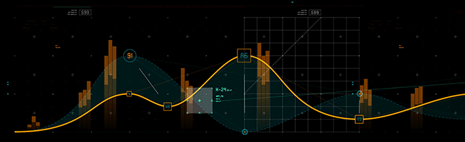

### WELCOME TO MY PAGE 👋👋👋
Hi! My name is Lam Le. I am currently a Data Analyst. I am enthusiastic about working with data and on the road to become a Data Engineer. 

## 📫 How to reach me:

[ LinkedIn](https://www.linkedin.com/in/lamlv723/)

 

